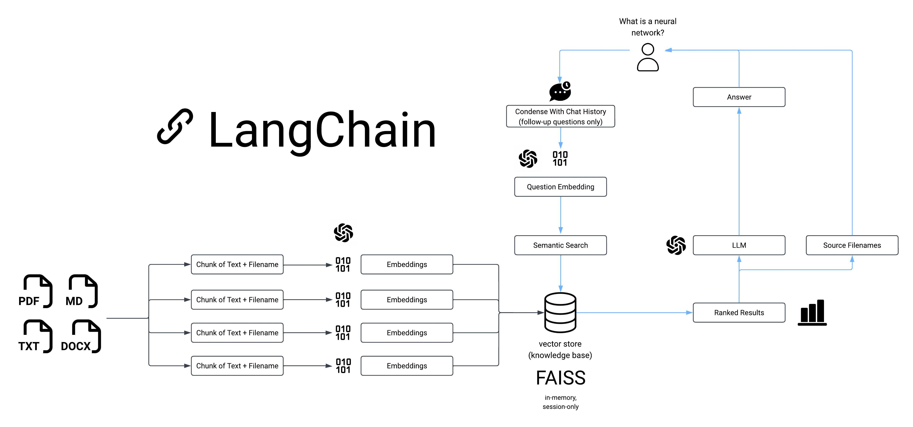
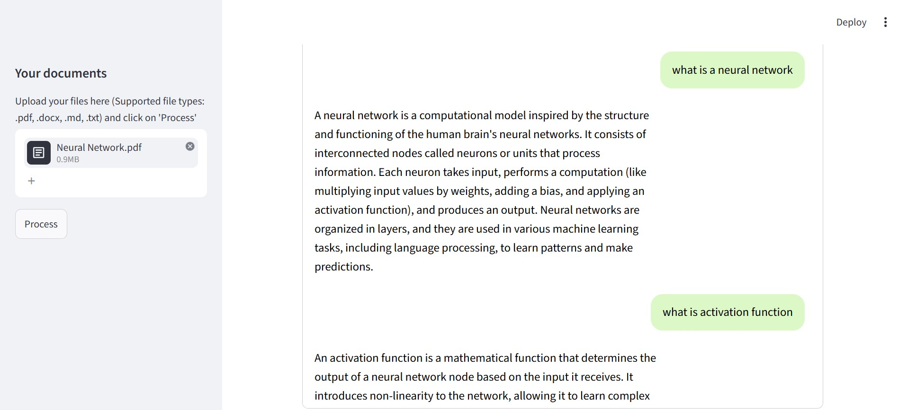

# MultiFILES Chat App

> You can find the tutorial for this project on [YouTube](https://youtu.be/dXxQ0LR-3Hg).

## Introduction
------------
The MultiFILES Chat App is a Python application that allows you to chat with multiple files. You can ask questions about the files using natural language, and the application will provide relevant responses based on the content of the files. This app utilizes a language model to generate accurate answers to your queries. Please note that the app will only respond to questions related to the loaded files.

## Supported File Types
------------
- PDF (`.pdf`)
- Word Documents (`.docx`)
- Markdown (`.md`)
- Plain Text (`.txt`)

## How It Works
------------



The application follows these steps to provide responses to your questions:

1. Files Loading: The app reads multiple files and extracts their text content.

2. Text Chunking: The extracted text is divided into smaller chunks that can be processed effectively.

3. Language Model: The application utilizes a language model to generate vector representations (embeddings) of the text chunks.

4. Similarity Matching: When you ask a question, the app compares it with the text chunks and identifies the most semantically similar ones.

5. Response Generation: The selected chunks are passed to the language model, which generates a response based on the relevant content of the files.

6. Citation Display: Alongside each answer, the app shows which uploaded file(s) the response was based on

## Chat UI
------------
The chat interface is styled after familiar messaging apps like WhatsApp and Messenger:
- Your questions appear as light-green bubbles, aligned to the right
- The AI's answers appear as plain text, aligned to the left, with each answer's source file(s) shown below it in smaller, muted text
- The full conversation scrolls within a single bordered chat window, keeping the rest of the page fixed in place



## Dependencies and Installation
----------------------------
To install the MultiFILES Chat App, please follow these steps:

1. Clone the repository to your local machine.

2. Install the required dependencies by running the following command:
   ```
   pip install -r requirements.txt
   ```

3. Obtain an API key from OpenAI and add it to the `.env` file in the project directory.
   ```commandline
   OPENAI_API_KEY=your_secrit_api_key
   ```

## Usage
-----
To use the MultiFILES Chat App, follow these steps:

1. Ensure that you have installed the required dependencies and added the OpenAI API key to the `.env` file.

2. Run the `app.py` file using the Streamlit CLI. Execute the following command:
   ```
   streamlit run app.py
   ```

3. The application will launch in your default web browser, displaying the user interface.

4. Load multiple files into the app by following the provided instructions.

5. Ask questions in natural language about the loaded files using the chat interface.

## Contributing
------------
This repository is a fork of the original [MultiPDF Chat App](https://github.com/tgifhacks/ask-multiple-pdfs), which was built as supporting material for a YouTube tutorial and does not accept further contributions upstream.

This fork is under active development as part of the NTU OSS Mock GSoC program, extending the original single-PDF chat app with multi-format document support, improved error handling, a redesigned chat UI, and per-file source citations. Development work and pull requests can be followed here:

- [PR #1 - Deprecated imports, error handling, initial tests](https://github.com/tgifhacks/ask-multiple-pdfs/pull/1)
- [PR #2 - Multi-format loaders, warning fixes, test suite update, chat UI redesign](https://github.com/tgifhacks/ask-multiple-pdfs/pull/2)
- [PR #3 - Per-file citation support](https://github.com/tgifhacks/ask-multiple-pdfs/pull/3)

Feel free to fork this project further and adapt it to your own needs, in line with the original MIT License.

## Known Limitations
------------
- **No OCR support**: scanned/image-based PDFs with no embedded text layer will not be processed; only text-extractable documents are supported.
- **Corrupted or mislabeled files**: a file with a valid extension (e.g. `.pdf`) but invalid or corrupted internal content may cause an unhandled exception during extraction, rather than a graceful warning.
- **Citation source-bleed on follow-up questions**: because the app uses a conversational retrieval chain, follow-up questions are reformulated using prior chat history before retrieval. This can occasionally cause a previous file's source to appear in the citation list for a new, unrelated question - this is expected behavior of the underlying conversational memory, not a bug in the citation logic itself.

## License
-------
The MultiFILES Chat App is released under the [MIT License](https://opensource.org/licenses/MIT).